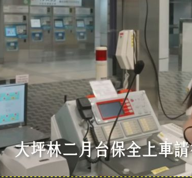
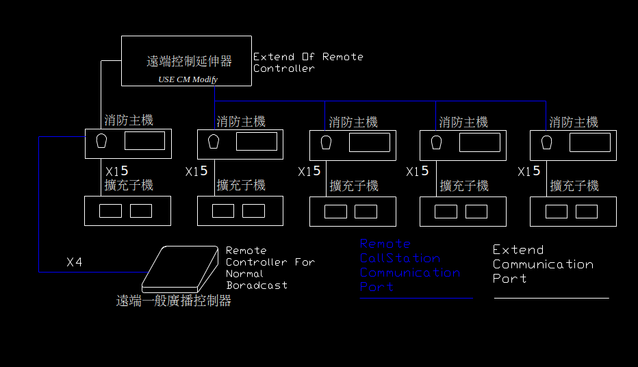

A Legacy Emergency Public Address Systems
===

The system is installed on TRTS(Taipei Rapid Transit system) many years ago

---

Basic system architecture
===

---
* N8500 for Main Control, Dual UART
* GMaster for Remote/Gateway, Dual UART
* Ext8500 for Remote/Digital Twin Main Control
